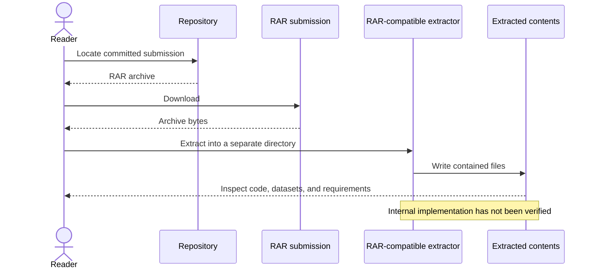

# Calorie Expenditure Prediction

A calorie expenditure prediction project distributed as a RAR archive.

**Technology:** Archived machine learning project

## Features

- Provide the project materials in one downloadable archive.
- Keep the original packaged submission available for extraction and inspection.

## Repository guide

| Path | Purpose |
|---|---|
| [Predict Calorie Expenditure.rar](Predict%20Calorie%20Expenditure.rar) | Packaged project materials. |

## Requirements and current limitations

Extract the RAR file with a compatible archive tool. Review the extracted source, dataset references, and dependency files before running any notebook or application.

This checkout contains the archive and README rather than extracted source. Model architecture, training metrics, and a runnable entry point have not been verified from the archive; no specific training or deployment command is claimed here.

## UML diagrams

### Archive inspection workflow

Only a RAR submission is available. This diagram describes inspecting that artifact, not an unverified calorie-prediction pipeline.

## Getting started

Download the archive listed above from this repository and extract it with a compatible archive utility. Setup depends on the files inside the archive; inspect them before running code.
